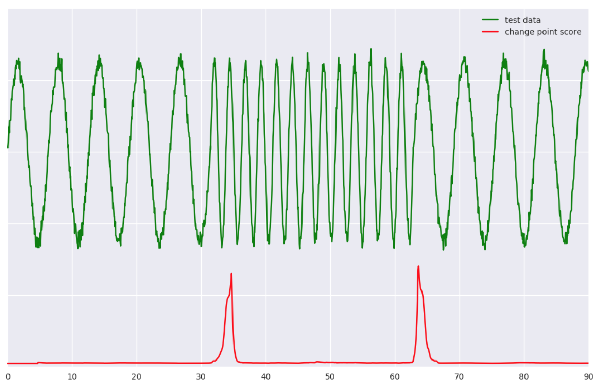

## Banpei
[](https://travis-ci.org/tsurubee/banpei)  

Banpei is a Python package of the anomaly detection.  
Anomaly detection is a technique used to identify unusual patterns that do not conform to expected behavior.

## System
Python ^3.6 (2.x is not supported)

## Installation
```bash
$ pip install banpei
```
After installation, you can import banpei in Python.
```
$ python
>>> import banpei
```

## Usage
#### Example
*Singular spectrum transformation(sst)*
```python
import banpei 
model   = banpei.SST(w=50)
results = model.detect(data)
```
The input 'data' must be one-dimensional array-like object containing a sequence of values.  
The output 'results' is Numpy array with the same size as input data.  
The graph below shows the change-point scoring calculated by sst for the periodic data.



The data used is placed as '/tests/test_data/periodic_wave.csv'.  You can read a CSV file using the following code.  
```python
import pandas as pd
raw_data = pd.read_csv('./tests/test_data/periodic_wave.csv')
data = raw_data['y']
```

SST processing can be accelerated using the Lanczos method which is one of Krylov subspace methods by specifying `True` for the `is_lanczos` argument like below.  
```python
results = model.detect(data, is_lanczos=True)
```

## Real-time monitoring with Bokeh
Banpei is developed with the goal of constructing the environment of real-time abnormality monitoring.  In order to achieve the goal, Banpei has the function corresponded to the streaming data.  With the help of Bokeh, which is great visualization library, we can construct the simple monitoring tool.   
Here's a simple demonstration movie of change-point detection of the data trends.

[](https://www.youtube.com/watch?v=7_woubLAhXk)  
https://youtu.be/7_woubLAhXk  
The sample code how to construct real-time monitoring environment is placed in '/demo' folder.

## The implemented algorithm
#### Outlier detection
* Hotelling's theory
#### Change point detection
* Singular spectrum transformation(sst)

## License
This project is licensed under the terms of the MIT license, see LICENSE.